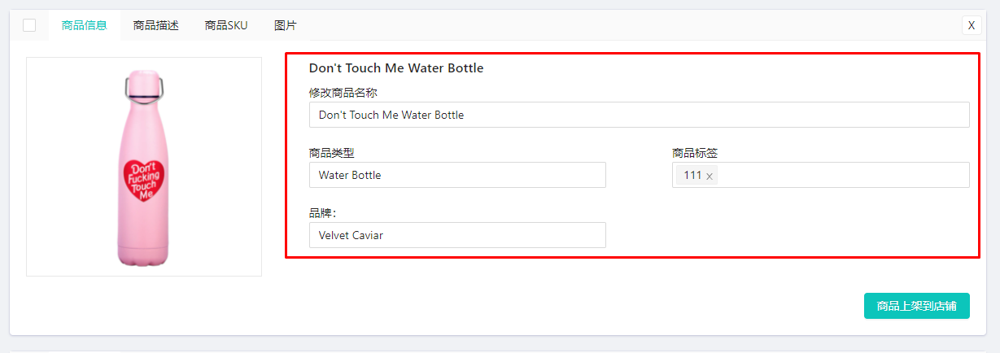

# DropSeek 操作手册

## 关于Dropseek

### Dropseek是什么

DropSeek是一款可以帮助独立站用户一键将速卖通或其它独立站上的商品导入至用户店铺的插件。DropSeek可跨平台，并且支持多店铺绑定，能够批量导入并上架商品，帮助卖家在个人独立站上销售更多品类的商品。

### Dropseek支持的平台

1. 支持绑定和上架的商品店铺平台：Shopify, ShopBase
2. 支持导入和上架的商品：速卖通, Shopify, ShopBase, shoplazza, xshoppy。

## 使用方法

### 如何安装Dropseek？

用户需要进入谷歌Chrome应用商店，搜索Dropseek。找到Dropseek插件，选择“添加拓展程序”后安装下载。

### 启动Dropseek

用户安装完成Dropseek后，在拓展程序中找到Dropseek点击即可进入登入页面。页面如下：

### 创建你的Dropseek账号

用户第一次访问的时候，通过以下步骤进行用户注册：点击“注册账号”-&gt;进入注册页面 -&gt; 输入邮箱地址 -&gt; 输入密码 -&gt; 再次输入确认密码 -&gt; 点击“注册”。页面如下：

### 登入Dropseek

注册成功的用户通过以下步骤进行用户登入：进入登入页面 -&gt; 输入邮箱地址 -&gt; 输入密码 -&gt; 点击“登录”。页面如下：

### 店铺授权

登入成功的用户，首先需要在Dropseek中绑定店铺\(目前支持的店铺有Shopify和ShopBase\)，并将店铺权限授权给应用。用户进入导航栏 -&gt; 进入店铺授权页面 -&gt; 点击“增加店铺”-&gt; 出现店铺授权弹窗 -&gt; 然后选择授权方式。授权方式一共有2种：

1. 用户可以通过“安装应用”来输入自己的店铺地址，进行店铺的自动授权。方法为点击“增加店铺” -&gt; 点击“安装应用”-&gt; 输入店铺地址 -&gt; 点击“确认”。完成后进入Shopify或ShopBase后台 -&gt; 点击气球图标 -&gt; 点击“Authorize”-&gt; 等待成功后，自动授权完成。

若用户选择使用安装app的形式来自动授权应用，当Token过期时，该页面顶部会出现Token过期的提示通知栏，并且在店铺列表中显示感叹号图标。用户需要重新使用APP授权或者使用手动更新密码的方式来激活店铺。

1. 用户还可以通过手动授权的方式来绑定店铺。通过创建“私有应用”来获取店铺的私有应用密码对店铺进行手动授权。方法为点击“增加店铺” -&gt; 点击“私有应用”-&gt; 输入店铺地址 -&gt; 输入私有应用密码或API密钥-&gt; 点击“确认”后，授权成功。

私有应用密码的获取方式可以在“常见问题”页面中找到，或进入私有应用 -&gt; 选择要绑定的店铺类型 -&gt; 点击“如何获取密码？”-&gt; 即可跳转到“常见问题”下的对应店铺授权指南。

### 导入商品

* * 1. 商品导入

在用户授权并添加店铺之后，就可以进行商品导入了。用户点击导航栏 -&gt; 进入导入列表页面 -&gt; 在“请输入您的商品详细网址”中输入商品的URL地址 -&gt; 点击“添加”-&gt; 等待，完成商品导入。用户每导入成功一个商品，消耗1点数的Seek积分（积分不足需要充值。导入店匠或速卖通的产品暂时不扣除积分）。

* * 1. 批量商品导入

付费过的充值用户可以一次性批量导入多个商品地址。用户可在“请输入您的商品详细网址”中输入多个商品的URL地址来批量导入商品（商品URL需要使用逗号，空格和回车来进行分割，批量导入一次性最多支持50个链接的导入）。

用户使用鼠标拖动输入框的右下角，可放大URL输入框。

### 查看商品导入的状态和进度

在用户导入当个商品或批量导入商品后，页面顶部会出现状态提示栏来告知用户当前商品导入的进度和状态。

1. 当商品正在导入时，显示当前已导入的数量和总导入数量，页面状态提示栏如下：

1. 当商品导入成功或所有商品都导入成功时，页面状态提示栏如下：

用户点击“点击跳转”文字，可以跳转到导入日志查看导入商品的信息。

1. 当商品导入失败或导入过程出现异常时，页面状态提示栏如下：

1. 当部分的商品导入失败或导入过程出现异常时，页面状态提示栏如下：

用户点击“点击查看”，可以查看导入失败的产品链接。点击这些链接可跳转至商品原网页。点击“联系客服”，可以在线和客服沟通问题。

### 搜索已导入的商品

所有导入成功的商品都会在 导航栏 -&gt; 导入列表页面中显示。并且用户可以在导入列在搜索框中输入关键词来搜索发现导入的商品。商品搜索方式有2种，按商品名称搜索和按照商品标签来搜索。

使用商品名称搜索：进入导入列表页面 -&gt; 找到搜索框 -&gt; 点击左边过滤图标 -&gt; 选择“按名称”-&gt; 在搜索框中输入商品名称关键词 -&gt; 点击“放大镜”图标，搜索到商品。

使用商品标签搜索：用户可以进入导入列表页面 -&gt; 找到搜索框 -&gt; 点击左边过滤图标 -&gt; 选择“按标签”-&gt; 在搜索框中输入商品标签关键词 -&gt; 点击“放大镜”图标或点击键盘上的Enter，搜索到商品。

当用户使用标签来搜索商品时，在搜索结果中匹配到的标签会改变颜色来提示用户。

### 批量上架导入的商品

用户可以批量上架所有在导入列表中的商品到用户已绑定的店铺中。进入导入列表页面 -&gt; 找到“选择所有的产品”的复选框/或则勾选要执行操作的商品 -&gt; 在旁边出现的“操作”下拉菜单中点击“商品上架到店铺”-&gt; 用户选择要导入的店铺 -&gt; 选择要上架到的商品分类 -&gt; 点击“确定”，商品上架完成。用户还可以通过点击商品前的复选框，来选中或排除要执行此批量操作的商品。

此外用户还可以点击“所有商品上架到店铺”按钮来直接上架所有的商品。

### 批量删除导入的商品

用户还可以批量删除所有已经在导入列表中的商品。进入导入列表页面-&gt; 找到“选择所有的产品”的复选框/或者勾选要执行操作的商品 -&gt; 在旁边出现的“操作”下拉菜单中选择并点击“从导入列表中删除”-&gt; 点击“确定”，删除成功。

### 批量添加商品标签

用户可以批量将一个或多个标签同时添加到导入列表的多个商品中。进入导入列表页面 -&gt; 找到并点击“选择所有的产品”的复选框/或者勾选要执行操作的商品 -&gt; 在旁边的操作下拉菜单中点击“批量添加所选商品的标签”-&gt; 输入标签内容/点击“增加标签”创建多个标签 -&gt; 点击“添加到所有被选中的商品中” -&gt; 完成添加。

### 批量修改商品价格

用户可以批量修改导入列表中的商品价格。进入导入列表页面 -&gt; 找到“选择所有的产品”的复选框/或者勾选要执行操作的商品 -&gt; 在旁边的操作下拉菜单中点击“批量修改所选商品的价格”-&gt; 找到要修改的商品 -&gt; 修改商品的价格/标题 -&gt; 点击“确定”，完成价格修改。批量修改价格，会将所有商品SKU的价格统一修改，若用户要修改部分库存类型的商品价格，请在商品SKU中修改。

### 修改导入商品的商品信息

用户可以修改导入商品的商品信息，可修改的商品信息包括商品名称，商品类型，商品品牌和商品标签（用户可增加新标签或删除已有标签）。进入导入列表页面 -&gt; 找到要修改的商品 -&gt; 点击“商品名称”/“商品类型”/“商品分类”或“商品标签”的输入框 -&gt; 输入要修改的内容/ -&gt; 完成修改。

在修改商品标签时，当用户点击一个标签中的“X”图标时，即可删除该标签；点击商品标签框后 -&gt; 输入标签内容后按“Enter”键，商品标签即可添加成功。

### 修改导入商品的商品描述

用户可以修改导入商品的商品描述。进入导入列表页面 -&gt; 找到要修改的商品 -&gt; 点击商品描述 -&gt; 修改编辑相关内容 -&gt; 完成修改。

### 修改导入商品的SKU

用户可以修改导入商品的商品SKU，可以修改的信息包括SKU，商品的价格和原价。进入导入列表页面 -&gt; 找到要修改的商品 -&gt; 点击商品SKU -&gt; 选择并修改相关内容 -&gt; 完成修改。用户点击“删除”即可删除该商品的库存类型。

### 查看导入商品的图片

用户可以查看导入商品的所有产品图片。进入导入列表页面 -&gt; 找到要修改的商品 -&gt; 点击图片 -&gt; 查看商品的所有图片。

### 立即发布新商品

用户可以设置是否立即将上架的商品在店铺中发布并进行销售。进入店铺设置页面 -&gt; 点击“店铺设置”-&gt; 勾选“新商品是否立即发布”复选框，完成设置。

### 由Shopify管理新商品库存

用户可以设置是否由Shopify来追踪并管理导入上架的新商品。进入店铺设置页面 -&gt; 点击“店铺设置”-&gt; 勾选“新商品是由Shopify管理”复选框，完成设置。

### 设置导入商品的价格规则

用户可以设置导入商品的价格规则，选择倍增导入商品的价格，固定加价或减价，还可以选择是否设置导入商品的原价。进入店铺设置 -&gt; 点击“价格规则”-&gt; 设置商品价格 -&gt; 输入价格规则（设置倍增，加价/减价）-&gt; 保存设置。开启设置商品原价：进入店铺设置 -&gt; 点击“价格规则”-&gt; 开启商品原价 -&gt; 设置价格规则 -&gt; 保存设置。

### 查看商品导入日志

用户可以查看所有商品的导入日志，日志以列表形式显示，显示的信息包括ID，URL链接，导入状态以及创建时间。用户可以通过导入商品的店铺类型，ID，URL或状态来筛选每一个导入的商品。进入导入日志页面 -&gt; 勾选店铺类型/输入ID/输入URL链接/选择状态（待导入，未导入，已导入，导入中）-&gt; 点击查询 -&gt; 显示相应的产品。点击“删除”对每一个导入商品执行删除操作。用户点击“重置”可以重新设置商品筛选条件。

### 查看商品上架日志

用户可以查看所有商品的上架日志，日志以列表形式显示，显示的信息包括ID，URL链接，导入的店铺以及创建时间。用户可以通过设置导入的店铺类型或商品导入状态（待上架，未上架，已上架，上架中）来筛选上架的产品。进入上架日志页面 -&gt; 选择上架店铺类型/选择上架的商品状态 -&gt; 点击查询 -&gt; 显示相应的上架商品。用户点击“重置”可以重新设置商品筛选条件。

### 在线充值Seek积分

用户可以在线充值Seek积分来导入或上架更多的商品到店铺中。当用户充值时，可以选择相应的充值套餐来额外获得赠送的点数，也可以自定义要充值金额。充值金额最少10元起，最大金额单次1000元。可以选择的支付方式有支付宝，微信和Paypal（暂时不支持）。用户进入Seek积分页面 -&gt; 选择充值套餐/自定义充值金额 -&gt; 选择付款方式 -&gt; 点击“确定”按钮 -&gt; 进行扫码支付（二维码2分钟后失效，失效后用户需重新点击图片刷新二维码。若10分钟内未完成支付，则订单取消用户需要重新发起支付） -&gt; 完成支付后到账Seek点数，订单完成。

在Seek积分页面的左上方显示的是用户当前Seek积分的数量和当前账户信息。用户点击“修改密码”可以更改当前Dropseek账户的密码。在Seek积分页面的左下方显示的内容是需要告知用户的充值信息和免责声明。

### 查看充值明细

用户可以查看所有的充值记录明细（明细包括充值编号，交易时间，支付金额，到账点数，支付方式和订单状态），并且可以通过选择时间来筛选显示一个时间段内的所有充值记录。用户进入Seek积分页面 -&gt; 点击充值记录 -&gt; 选择时间段 -&gt; 点击查询，显示订单详情。若用户对订单有疑问，可以点击“联系客服”来在线和客服反馈问题。

### 查看用户常见的Q&A

用户可以在常见问题中找到应用的授权指南以及用户在导入或上架商品过程中可能会遇到的问题和答案。用户进入常见问题页面 -&gt; 寻找要解决的问题- &gt; 点击问题 -&gt; 在对应问题下得到展开的相应问题答案。

### 修改DropSeek账号密码

用户可以随时修改当前DropSeek账号的密码，进入个人中心 -&gt; 点击修改密码 -&gt; 输入新密码 -&gt; 再次输入新密码 -&gt; 点击确认 -&gt; 修改完成。

### 查看当前版本说明

用户可以查看当前DropSeek版本的新增加功能，移除功能或优化功能项的说明。用户点击进入版本说明页面，即可发现并阅读浏览说明。

