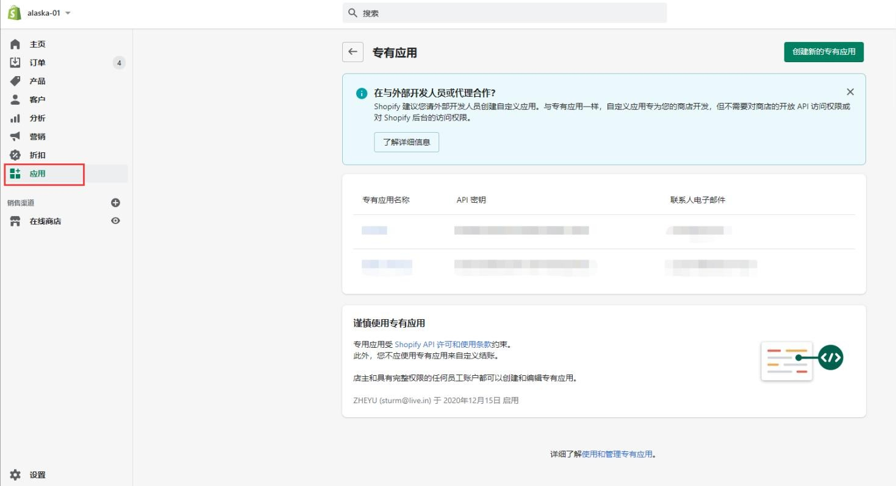
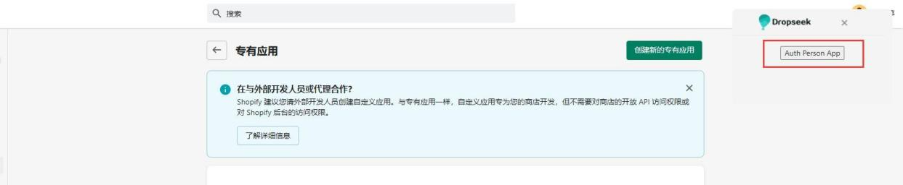
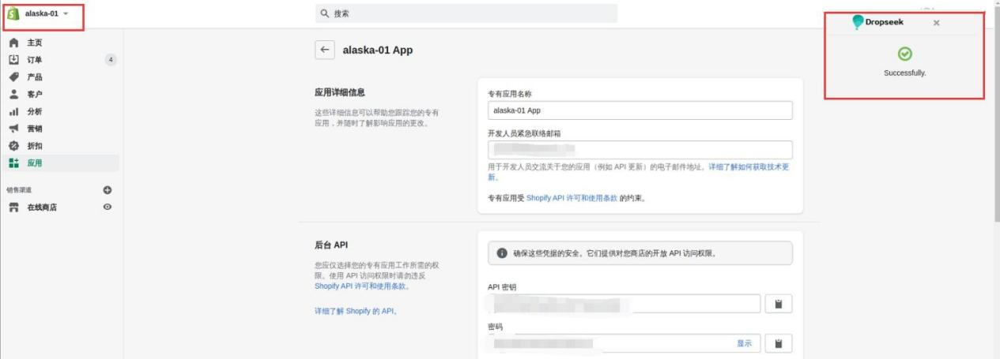
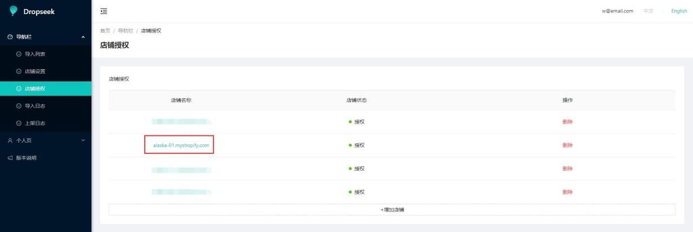

# Shopify店铺 自动授权

## **自动授权**

注：授权店铺登录账户必须为店铺创建者

注：授权前请先登录 dropseek 后台

1. 打开 **Google** 浏览器，输入以下网址，安装 **dropseek** 插件

https://chrome.google.com/webstore/detail/dropseek-product-sourcing/cjekpooehbkib bkgdbfmcnmhgegklnmj?utm\_source=chrome-ntp-icon

* 点击【Add to Chrome】

* 添加扩展程序

* 安装完成

2. 进入 **shopify** 店铺后台**-&gt;**应用

3. 点击 **dropseek** 插件图标，弹出弹窗

4. 点击【**Auth Person APP**】进行授权

* 后台授权中，请耐心等待

* 授权成功

5. 重新进入 **dropseek** 后台，显示店铺已授权

