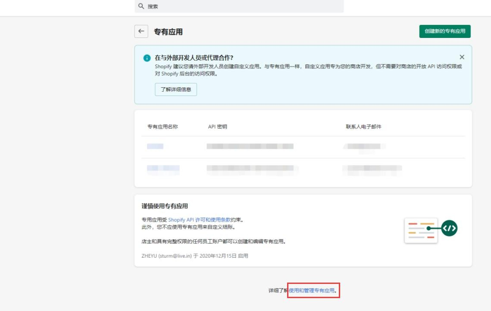
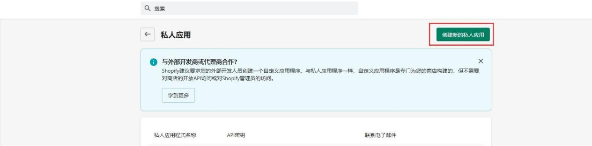
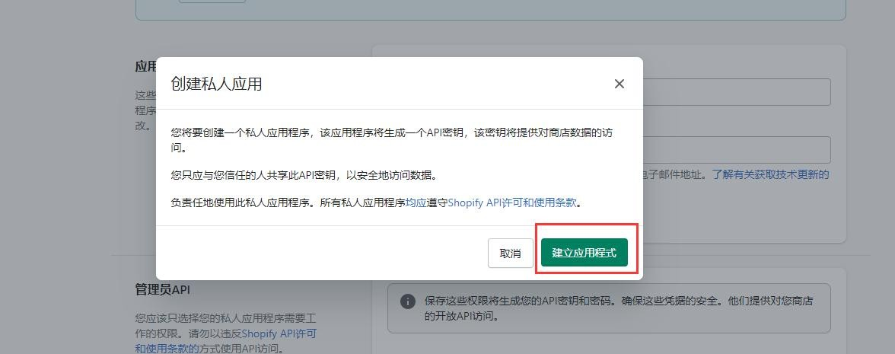
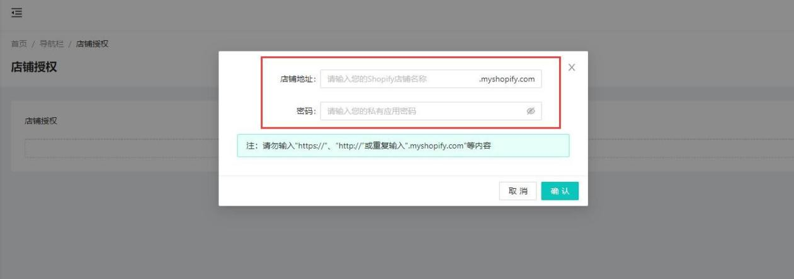
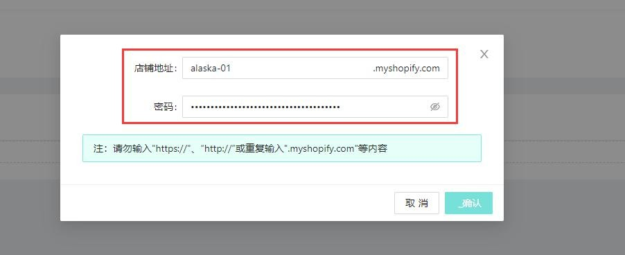

# Shopify店铺 手动授权

手动授权

注：授权店铺登录账户必须为店铺创建者

注：授权前请先登录 dropseek 后台

1. 进入 **shopify** 店铺后台**-&gt;**应用

2. 进入【使用和管理专有应用】或【管理私人应用】

* 确认开启私人应用

3. 点击【创建新的私人应用】

4. 填写私人应用名称以及联系人邮箱

5. 给予 **Admin API** 对应权限**/4** 个

6. 保存，确认创建 **APP**

7. 私人应用创建完成

8. 创建完成后获取到 **Admin API** 中的 **password**

9. 进入 **dropseek** 后台，登录

10. 进入导航栏**-&gt;**店铺授权，点击【增加店铺】

11. 输入店铺名以及之前获取到的 **Admin API** 中的 **password**，确认

注：password 需明文显示后复制

12. 授权成功，完成

